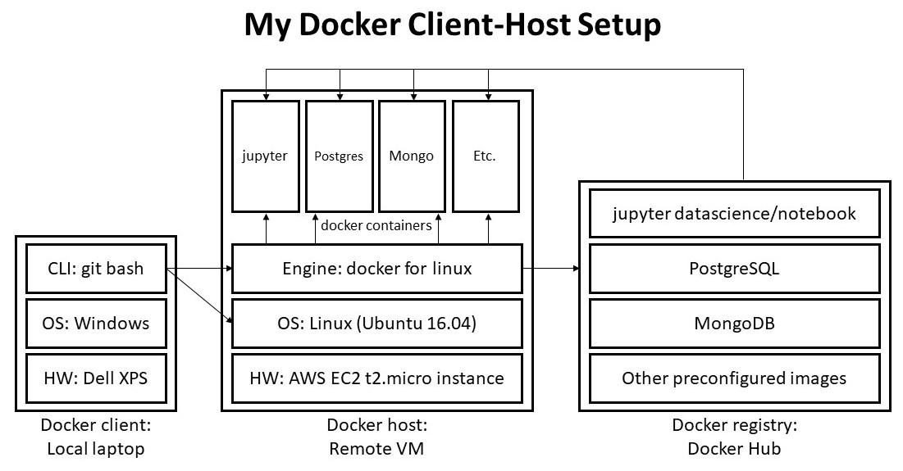
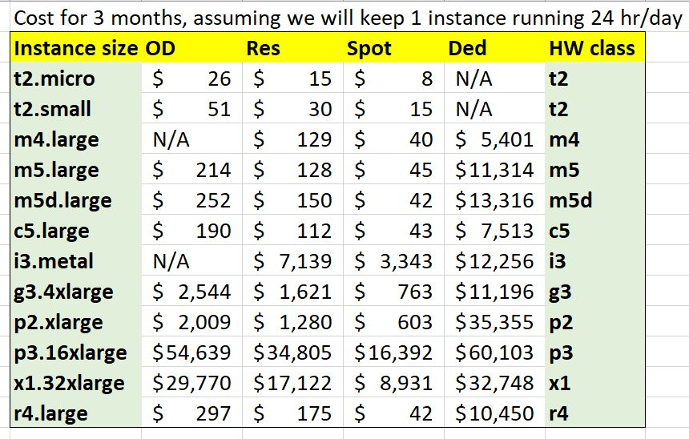

# How to Configure a Jupyter Datascience Notebook Server on Amazon Web Services
 - Detailed outline and explanation of every step
  - Who does what, when, where and why
 - Submitted as a README.md in a Github Repository

## Summary of contents:
1. Use git bash to create SSH keys on local machine
1. Set up an EC2 machine on Amazon Web Services
1. Install and configure Docker on the EC2 machine
1. Install Jupyter notebook
1. Diagram of system
1. Pro forma budget to run this system for 3 months


## Expanded Summary of contents:
### 1. Create SSH keys on local machine

 - Purpose: The ssh will allow me to use my local machine to securely connect to other machines via the Web.
 - `ssh` stands for "secure shell"
 - ssh key pair: id_rsa (a private key) and id_rsa.pub (a public key)

### 2. Set up a virtual machine on AWS (Amazon Web Services)
 - What it is: An AWS EC2 machine is a virtual machine that I can connect to via the Internet and use via git bash and/or a browser on my local machine.
 - Purpose: The cloud machine will allow me to:
  - Configure and use an operating system (e.g., Linux) that differs from my local machine
  - Access hardware that may perform better than and exceed what I have on my laptop
  - Install and use software without having to load it on my own laptop
  - Keep a jupyter notebook running full-time on the VM even when I shut down my laptop ???
 - EC2 (i.e., ECC, stands for "elastic computing cloud")
 - Configure security for the EC2 machine

### 3. Install Docker 
 - What it is: Docker is an improvement on the implementation of virtual machines that allows me to run a trimmed down version of any OS in a "container" on a box of any type (Linux, MacOS, Windows)
 - Purpose: Docker will allow me to build applications on any system (hardware & OS) that runs docker, and have those applications run exactly the same way on any other system that runs docker.

#### Docker Installation

#### Obtaining the correct Docker image

#### Running the correct Docker image as a container

### 4. Jupyter notebook 
#### Jupyter security concerns

- A Python kernel running on a Jupyter notebook server is able to run arbitrary code on your server as in it could change root permissions on the system. 
- It is worth noting that you are running the server in a Docker container so it is isolated from your main system. This means that if someone was to gain access to the Jupyter server they would only be able to do damage to the docker container. 

### 5. Diagram: My Docker Client-Host Setup

### 7. Budget
 - Detailed budget of the costs of running a Jupyter Data Science Notebook Server for three months using at least three different kinds of EC 2 instances

## Step-by-step instructions

### Begin on your local machine (Windows, MacOS, Linux):
1. Launch Git Bash (MinGW-W64 on Dell laptop)

Different methods to launch:
 - Start | Git Bash icon
 - Start | MinGW-W64 Project | Run Terminal
 - Cortana Search Box "git" | Git Bash
  - You may notice that initially the window that comes up has "CMD.EXE" in the title bar; this is quickly replaced by "MinGW-W64"
 -  Cortana Search Box "ming" | Run Terminal
 - Launch `mingw-w64.bat` from the `C:\Program Files\mingw-w64\x86_64-8.1.0-win32-seh-rt_v6-rev0\` folder
  - NO, THIS LAUNCHES "CMD.EXE" FOR SOME REASON
   - `C:\Program Files\mingw-w64\x86_64-8.1.0-win32-seh-rt_v6-rev0>echo off C/WINDOWS/SYSTEM32/CMD.EXE`
   
   Can I safely edit the bat file?
   ```
   echo off
   set PATH=C:\Program Files\mingw-w64\x86_64-8.1.0-win32-seh-rt_v6-rev0\mingw64\bin;%PATH%
   rem echo %PATH%
   rem cd "C:\Program Files\mingw-w64\x86_64-8.1.0-win32-seh-rt_v6-rev0\mingw64\bin"
   cd "C:\"
   "C:\WINDOWS\system32\cmd.exe"
   ```

### Next steps in git bash:

1. At the prompt, enter `pwd` to print the working directory:
```
karls@DESKTOP-VAQRJL8 MINGW64 ~
$ pwd
/c/Users/karls
```

1. Enter `ls ~/.ssh` to check if an `.ssh` dir exists and, if yes, list its files:
```
karls@DESKTOP-VAQRJL8 MINGW64 ~
$ ls ~/.ssh
ls: cannot access '/c/Users/karls/.ssh': No such file or directory
```  
 - The output above indicates that .ssh does not exist.
 - **IMPORTANT: If .ssh already exists, DO NOT create a new one** as this can cause problems.
  - **What problems???**
  - If .ssh already exists, use one of the key pairs that already exist in it. 
   - Should there only be one pair???
   - If there can be multiple pairs, then what is the problem with created a new one???

1. If the .ssh directory does not already exist, create it:
```
karls@DESKTOP-VAQRJL8 MINGW64 ~
$ mkdir -p .ssh
```
 - `-p` stands for "parents", telling mkdir to create a directory and any parent directories that don't already exist
 - **DOES IT ALSO suppress the error that would be raised if the dir already existed.*** **YES, it does**
  - ISN'T THAT LETTING AN ERROR PASS SILENTLY??? DON'T WE WANT ERRORS TO BE NOISY/LOUD???

1. Enter `ssh-keygen` to generate a public/private rsa key pair:
```
karls@DESKTOP-VAQRJL8 MINGW64 ~
$ ssh-keygen
```
 - Press `Enter` to accept the default file in which to save the key
 - Press `Enter` to use no passphrase
 - Press `Enter` to confirm no passphrase
```
Generating public/private rsa key pair.
Enter file in which to save the key (/c/Users/karls/.ssh/id_rsa):
Enter passphrase (empty for no passphrase):
Enter same passphrase again:
Your identification has been saved in /c/Users/karls/.ssh/id_rsa.
Your public key has been saved in /c/Users/karls/.ssh/id_rsa.pub.
The key fingerprint is:
SHA256:bbxQVVPUObbspq3a5JsaZ5tOd6/JboKuA5OHVgUiDTY karls@DESKTOP-VAQRJL8
The key's randomart image is:
+---[RSA 2048]----+
|    Eo. ..  ..oo=|
|   . o..  ..   =.|
|         ..   o o|
|        .+     o |
|       +S +   .  |
|      * .o .   o |
|     . +  .o =+..|
|        . . Xo*oo|
|        .+.o+&B..|
+----[SHA256]-----+
```

1. Enter `ls -a` to list (a)ll files and folders in the home dir: **-a MEANS ALL??? Yes.**
```
karls@DESKTOP-VAQRJL8 MINGW64 ~
$ ls -a
 .anaconda/
 .aws/
 .bash_history
 .conda/
 .ipython/
 .jupyter/
 .matplotlib/
 .ssh/          # we're confirming that this folder was created
 Desktop/
 Documents/
 github/
'My Documents'@
 R/
 xgboost_install_dir/
```

1. Enter `ls ~/.ssh` to list the files in the `.ssh` dir:
```
karls@DESKTOP-VAQRJL8 MINGW64 ~
$ ls ~/.ssh
id_rsa  id_rsa.pub
```

1. Enter `cat ~/.ssh/id_rsa.pub` to print the public key to screen:
```
karls@DESKTOP-VAQRJL8 MINGW64 ~
$ cat ~/.ssh/id_rsa.pub
ssh-rsa AAAAB3NzaC1yc2EAAAADAQABAAABAQC1SRG7l18hVaNRItzur0uIv9qdtpztHLa+b8vh/ESAEi2YJpCc26Ob3de1vH4/H0KTImE0fgDoRGHBH11L
dsubSi1ocABqdy0QxA1KFFRIOqa0G3n4ipapTzEyGj580zNz8avJuBgRKL+xWWrAXKQPbXwxZuUoOjW4pi/VhK3FvTC5WTKEq4OQ+6p6w6Xea4yys68BowRP
7aIncRtxodKS78f11EVHF2sjF7Aec9zSkHsiTBGsxt8m+M7g2xwSQMR3JyPmpfivZ24Xqy3STQOtd4w0vu24PNYWpLgn3Mx0OrCe/LIU8AKTk/BHzF4uPnF6
9jfyYACROuONnia7CUgj karls@DESKTOP-VAQRJL8
```

1. Enter `cp ~/.ssh/id_rsa.pub ~/Desktop/` to make a copy of the key file and save it to the Desktop
 - Syntax: `<command> <home/path/filename to copy> <location to copy to>`
```
karls@DESKTOP-VAQRJL8 MINGW64 ~
$ cp ~/.ssh/id_rsa.pub ~/Desktop/
```

1. Enter `ls ~/Desktop/` to check that the file was copied to the Desktop:  
```
karls@DESKTOP-VAQRJL8 MINGW64 ~
$ ls ~/Desktop/
/c/Users/karls/Desktop/:
'!Journaling - Shortcut.lnk'*   desktop.ini   'Microsoft Edge.lnk'*  'Visual Studio 2015.lnk'*
 Calendar.lnk*                  id_rsa.pub     OneDrive.lnk*
'chapter 3 - Shortcut.lnk'*     Kindle.lnk*   'Steps Recorder.lnk'*
'Chapters - Shortcut.lnk'*      Magnify.lnk*   Store.lnk*
```
 - We can see that the file was copied as expected.
1. Copy the text of id_rsa.pub from the output of `cat ~/.ssh/id_rsa.pub` (completed a few steps back) to the clipboard:
 - Be sure to select the entire output of the `cat ~/.ssh/id_rsa.pub` command above
  - Selection must include `"ssh-rsa "` with space at beginning and `" karls@DESKTOP-VAQRJL8"` at end

## Set up the ssh keys on GitHub
### These steps are done on github.com:

1. Log in to your github.com account.
1. Press the down arrow on the user icon and select **Settings**.
1. Select **SSH and GPG keys**.
1. Press the **New SSH Key** button.
1. Paste the contents of the clipboard into the **Key** cell, then press the **Add SSH Key** button.
1. **IS THERE A STEP HERE TO LOOK AT GITHUB TO MAKE SURE THIS STEP WORKED??? Sure, you can just go to Github.com**

### These steps are done in git bash:

1. Add github to the `.ssh` list of known hosts:

 - This step is also known as "authenticating" XXX ???
  - IS THIS COMMAND ALSO ATTEMPTING TO GET SHELL ACCESS FROM GITHUB? (GH outputs below that it does not give shell access.) WHAT DOES THAT MEAN??? `ssh user@ip` is the syntax for requesting shell access. Github also uses ssh to pass files back and forth. Rather than testing the ssh configuration by pushing files, this is an alternative to verify the ssh configuration, but it is then ultimately rejected once the configuration is confirmed.
 - `"authenticity of host 'github.com (192.30.253.113)' can't be established."`
  - Type `yes <Enter>` to confirm that you want to continue connecting.
 - Outputs:
  - `"Warning: Permanently added 'github.com ..."` is OK.
  - `"PTY allocation request failed on channel 0"` means XXX ???
  - `"GitHub does not provide shell access. Connection to github.com closed."` is OK.

```
karls@DESKTOP-VAQRJL8 MINGW64 ~
$ ssh git@github.com
The authenticity of host 'github.com (192.30.253.113)' can't be established.
RSA key fingerprint is SHA256:nThbg6kXUpJWGl7E1IGOCspRomTxdCARLviKw6E5SY8.
Are you sure you want to continue connecting (yes/no)? y
Please type 'yes' or 'no': yes
Warning: Permanently added 'github.com,192.30.253.113' (RSA) to the list of known hosts.
PTY allocation request failed on channel 0
Hi neigedoi! You've successfully authenticated, but GitHub c.
Connection to github.com closed.
```

2) Display a list of known hosts for `.ssh`
```
karls@DESKTOP-VAQRJL8 MINGW64 ~
$ less ~/.ssh/known_hosts
```
Show ouptuput of this command.

## Set up machine on AWS
### These steps are done on aws.com:

1. Log in to account on AWS.com.
1. Click on the **Services** tab and select **EC2**.
1. Press **Key Pair**, then press **Import Key Pair**.
#### Set up security protocols
1. From the EC2 Dashboard, select **Security Groups**, then press the **Create** button.
- We will configure the security for our machine.
1. Give it a **Name** and a **Description**; e.g., "UCLA_class."  
1. Create "rules" to configure the ports to be used for web traffic on our machine. Press the **Add Rule** button and create a rule for SSH:
 - Col 1: Select **SSH**
 - Port: Type **22**
 - Source: Select **Anywhere**
 - Press the **Create Rule** button
1. Follow the same process (**Add Rule**, configure, **Create**) to specify a port for each of the following types of web traffic that we want to be able to use:
- HTTP: Port: **80**, Source: **Anywhere**
- HTTPS: Port: **443**, Source: **Anywhere**
 - We will run Jupyter on port 443.
- PostgreSQL: Port: **5432**, Source: **Anywhere**
- Custom TCP: Port: **27016**, Source: **Anywhere**
 - We will run the Mongo DB server on 27016.
 - This will be machine-to-machine communication between jupyter and mongo.
 - This port number is one less than 27017 which has **WHAT SIGNIFICANCE???** 
  - SOMEHOW WE WOULD HAVE MORE HACKING ATTEMPTS ON 27017.???
 - NOTE: We can specify what port to use by appending `:port_number` to the end of a URL
  - E.g., `github.com:80`
1. From the EC2 Dashboard, select **Instances** (may be **Running Instances**).
1. Press the **Launch Instance** button.
1. Choose **AMI** (Amazon Machine Image): _Ubuntu 16.04_.
 - A fully-configured server image.
1. Choose **Instance Type** (hardware): _t2.micro_ (1 CPU)
1. Configure **Instance**: _default_
1. Add **Storage** (hard drive): Size: _20_ GiB
1. Add **Tags**: _default_
1. Configure **Security Group**: Press the **Select and Existing** button, then select the checkbox of the security group named above.
1. Press ** Review and Launch**.
1. Review: If everything looks right, press **Launch**.
1. Select **Choose an existing key pair**, then select "id_rsa 2018_July."
1. Press the **Acknowledge** button.
1. Press **Launch Instance**.
1. Press ** View Instances**.
1. Find the instance you just created and give it a name; e.g., UCLA_DS_class.
1. Select the checkbox at the beginning of the line, then scroll down the page and copy the instance's **public IPv4** address to the clipboard.

## CONNECT AWS MACHINE TO GIT BASH???
### These steps are done in git bash:
1. At the prompt, type `ssh ubuntu@`_`<ip>`_, pasting in the IP address from the clipboard in place of _`<ip>`_:
```
karls@DESKTOP-VAQRJL8 MINGW64 ~
$ ssh ubuntu@18.188.45.167
```

 - Press `<Enter>` and type "yes" and press Enter at the Are you sure prompt.

```
The authenticity of host '18.188.45.167 (18.188.45.167)' can't be established.
ECDSA key fingerprint is SHA256:cBxYWZrVw8vFYxHoPnpSfPCd+iNhJmfu92jwOf7JjO4.
Are you sure you want to continue connecting (yes/no)? yes
Warning: Permanently added '18.188.45.167' (ECDSA) to the list of known hosts.
Welcome to Ubuntu 16.04.4 LTS (GNU/Linux 4.4.0-1061-aws x86_64)

 * Documentation:  https://help.ubuntu.com
 * Management:     https://landscape.canonical.com
 * Support:        https://ubuntu.com/advantage

  Get cloud support with Ubuntu Advantage Cloud Guest:
    http://www.ubuntu.com/business/services/cloud

0 packages can be updated.
0 updates are security updates.

The programs included with the Ubuntu system are free software;
the exact distribution terms for each program are described in the
individual files in /usr/share/doc/*/copyright.

Ubuntu comes with ABSOLUTELY NO WARRANTY, to the extent permitted by
applicable law.

To run a command as administrator (user "root"), use "sudo <command>".
See "man sudo_root" for details.     
```

Notice that we are now at a NEW bash prompt: **ubuntu@ip-172-31-25-201:~$**

## Install and Configure Docker 
### These steps are done in git bash:
1. Run the Docker shell script to **install the docker engine**:
```
curl -sSL https://get.docker.com | sh
```

 - `https://get.docker.com` is a shell script
 - The shell script is piped into the sh(ell) program so it will be run immediately
  - Before running the `curl` command we can view the contents of `get.docker.com` to confirm that it is a shell script by opening the URL in a browser
  - Its first line, `#!/bin/sh` (hash bang, `#!`, pronounced "shebang"), confirms it is a shell script
 - PIPING STRAIGHT INTO SH IS BAD PRACTICE SECURITY-WISE, ESP IF WE DO NOT KNOW OR TRUST THE SHELL SCRIPT.
 - JOSH ASSURES US IT IS SAFE AND OK IN THIS CASE, AND MUCH FASTER THAN THE ALTERNATIVE.
 - I'D LIKE TO LEARN THE SAFE, KOSHER PROCESS TOO.

2) Add our ubuntu server on the AWS EC2 machine to the docker user group
```
sudo usermod -aG docker ubuntu
```
 - `-a` ???
 - `-G` ???

3) Disconnect from ubuntu: Ctrl-D or exit.
4) Reconnect:
```
ssh ubuntu@18.188.45.167
```

5) Launch `tmux`.
 - `tmux` stands for "terminal multiplexer." It is a more stable shell than sh. In general we won't need to use tmux, but here we used it bc we were proceeding slowly and sometimes sh dies silently when left sitting too long.
```
tmux
```

6) Have Docker **pull jupyter** image from the docker hub.
 - Jupyter staff maintain jupyter images to be used with each flavor of docker (Linux, MacOS, etc.).
 - The jupyter staff also maintain several versions of the jupyter image. We are installing the **datascience-notebook image**, a fairly hefty version, but there are others with fewer features (no numpy/pandas/scipy, etc.) and a few that include even more features (tensorflow, pyspark).
```
docker pull jupyter/datascience-notebook
```

7) Run the jupyter/datascience-notebook image to install and configure it:
```
docker run -d \
-p 443:8888 \
-v /home/ubuntu:/home/jovyan \
jupyter/datascience-notebook
```
 - `-d` **d**etached mode but 
  -**what does that mean again and why do we want to be in detached mode??? detached from what?**
  -  is it docker that is detached ("docker run in -d mode")? or is it jupyter("docker run a detached jupyter")?
 - `-p` create **p**arents???, SUPPRESS ERRORS??? **p**ort???
 - `443:8888` : This command attaches port 8888 from the docker container to port 443 on our host. 
  - Our host is the EC2 ubuntu machine ???
  - What exactly is a "port"? Analogous to a CB radio channel?
 - `-v` means "mounting a **v**olume". "Mounting" suggests that one is on top, or otherwise "in control." Which is "in control"???
 - `/home/ubuntu:/home/jovyan` This command also attaches `/home/ubuntu` on the host to `/home/jovyan` in the container. 
  -**So _inside_ the container is a trimmed down version of ubuntu that has this `jovyan` directory???** 
  - After this command, will these 2 folders have the same contents? Or will they sync any files that they have in common? Or will only jovyan send files to ubuntu?
  - Did we ALREADY HAVE AN UBUNTU DIR on the EC2 VM AND A JOVYAN DIR on the XXX in the docker container? Or did this command create one or both?
 - DOES THIS command spawn the NEW JUPYTER PAGE???
 - does this return the docker container ID?

Additional notes:
 - docker ps
 - docker stop jovyal XXX # kill
 - docker ps -a
 - ls -la
 - docker logs _containerID_ (first few chars, enough to be unique)
 - docker exec _containerID_ # jupyter nb list

### Next steps in Web browser:

1. To configure the Jupyter page so we can use it:
 - From AWS account, copy the public ip address to clipboard as before. Append `443` to the end.
 - e.g., `192.88.78.68:443`
 - **In github, copy token = ???**
 - Paste into **Password or Token** textbox on jupyter page.
1. Test jupyter by creating a new notebook and saving it.
 - It should appear in the jupyter file list.
1. In bash, run `ls` to see the file there also.
1. In AWS, terminate the machine instance.
 - TERMINATING WAS ONLY THE FIRST TIME, SO WE COULD DO IT ALL AGAIN FOR PRACTICE???
 - Select **Instance**, **Actions** button, **Instance State**, **Terminate**.

### How to create an alias in bash
TK

### Obtaining the correct Docker image

See `http://jupyter-docker-stacks.readthedocs.io/en/latest/using/selecting.html#jupyter-datascience-notebook`

#### Selecting an Image
Using one of the **Jupyter Docker Stacks** requires two choices:

1. Which Docker image you wish to use
1. How you wish to start Docker containers from that image

 - jupyter/base-notebook is a small image supporting the options common across all core stacks. It is the basis for all other stacks.
 - jupyter/minimal-notebook adds command line tools useful when working in Jupyter applications.
 - jupyter/r-notebook includes popular packages from the R ecosystem.
 - jupyter/scipy-notebook includes popular packages from the scientific Python. 
 - jupyter/tensorflow-notebook includes popular Python deep learning libraries. 
 - jupyter/datascience-notebook includes libraries for data analysis from the Julia, Python, and R communities.
 - jupyter/pyspark-notebook includes Python support for Apache Spark, optionally on Mesos.
 - jupyter/all-spark-notebook includes Python, R, and Scala support for Apache Spark, optionally on Mesos.

image of the relationship of these in images folder

We will use `jupyter/datascience-notebook`.

### Running the correct Docker image as a container
 - See above step by step instructions

## Jupyter notebook 

### Jupyter security concerns
TK

## Diagram: My Docker Client-Host Setup



## Budget

The table below shows the costs of running a Jupyter Data Science Notebook Server for three months using several different kinds of EC2 instances. From this I would look for opportunities to use spot instances. It is much cheaper than on demand instances, although it might require more monitoring and restarts of running operations because it can be interupted if AWS needs the server capacity I am using.



Further below is am expanded review of pricing for these various types of machines.

Different types of machines are available 

 - General Purpose - Current Generation (or Previous Gen cheaper)
 - Compute Optimized - Current Generation (or Previous Gen)
 - GPU Instances - Current Generation
 - Memory Optimized - Current Generation (or Previous Gen)
 
Each of these categories offers a variety of "sizes" of machines, depending on number/model of CPU, RAM, storage, etc.

We will present Linux pricing for the following machines (US East (Ohio)):

**General Purpose - Current Generation**
- These machines are good for XXX
 - t2.micro	
 - t2.small	
 - m4.large	
 - m5.large	
 - m5d.large	

**Compute Optimized - Current Generation**
- These machines are good for XXX
 - c5.large	
 - i3.metal	
 
**GPU Instances - Current Generation**
- These machines are good for XXX
 - g3.4xlarge	
 - p2.xlarge	
 - p3.16xlarge	
 
**Memory Optimized - Current Generation**
- These machines are good for XXX
 - x1.32xlarge	
 - r4.large	

There are four ways to pay for Amazon EC2 instances: On Demand, Reserved Instances, Spot Instances, and Dedicated Hosts.

##### On-Demand
 - Compute capacity by the hour (some instances are by the second).

 - **Advantages**:
  - No longer-term commitments, no upfront payments.
  - You can increase/decrease your compute capacity depending on the demands of your application.

 - **Good for**
  - Applications with short-term, spiky, or unpredictable workloads that cannot be interrupted.
  - Applications being developed or tested on Amazon EC2 for the first time.
  

On-demand pricing:

**General Purpose - Current Generation** (models t2, m3, m4, m5, m5d)

| Model | USD/hr |
| ---------- | --------: |
| t2.micro | 0.0116 |
| t2.small | 0.023 |
| m4.large | N/A |
| m5.large | 0.096 |
| m5d.large | 0.113 |

**Compute Optimized - Current Generation** (models: c5, c5d, c4, d2, h1, i2, i3)

| Model | USD/hr |
| ---------- | --------: |
| c5.large	| 0.085 |
| i3.metal	| N/A |
 
**GPU Instances - Current Generation** (models: g3, p2, p3)

| Model | USD/hr |
| ---------- | --------: |
| g3.4xlarge  | 1.14 |
| p2.xlarge	  | 0.90 |
| p3.16xlarge |	24.48 |
 
**Memory Optimized - Current Generation** (models: x1, r3, r4)

| Model | USD/hr |
| ---------- | --------: |
| x1.32xlarge |		13.338 |
| r4.large	| 0.133 |

##### Reserved Instances
 - Up to 75% discount.
 - Requires 1 or 3 year term.
 - Provide a capacity reservation, giving you additional confidence in your ability to launch instances when you need them.
 - Good for applications that have steady state or predictable usage.

Reserved instance pricing (based on up front payment for a standard 1-year term):

**General Purpose - Current Generation** (models t2, m3, m4, m5, m5d)


| Model | USD/hr |
| ---------- | --------: |
| t2.micro | 0.0067 |
| t2.small | 0.0135 |
| m4.large | 0.0579 |
| m5.large | 0.0572 |
| m5d.large | 0.0671 |

**Compute Optimized - Current Generation** (models: c5, c5d, c4, d2, h1, i2, i3)


| Model | USD/hr |
| ---------- | --------: |
| c5.large	| 0.0503 |
| i3.metal	| 3.1987 |
 
**GPU Instances - Current Generation** (models: g3, p2, p3)


| Model | USD/hr |
| ---------- | --------: |
| g3.4xlarge	| 0.7261 |
| p2.xlarge	| 0.5733 |
| p3.16xlarge	| 15.5937 |
 
**Memory Optimized - Current Generation** (models: x1, r3, r4)


| Model | USD/hr |
| ---------- | --------: |
| x1.32xlarge		| 7.6711 |
| r4.large	| 0.0782 |

##### Spot Instances
 - Allow you to request spare Amazon EC2 computing capacity for up to 90% off the On-Demand price. 

 - **Good for**
  - Applications w/ flexible start and end times
  - Applications that are only feasible at very low compute prices
  - Urgent computing needs for large amounts of additional capacity.
  
Spot Instances can be interrupted by EC2 with two minutes of notification when EC2 needs the capacity back. You can use Spot Instances for various fault-tolerant and flexible applications, such as big data, containerized workloads, high-performance computing (HPC), stateless web servers, rendering, CI/CD and other test & development workloads. 

Spot Fleet, which automates the management of Spot instances. You simply tell Spot Fleet how much capacity you need and Fleet does the rest.

PAUSE & RESUME
With the new Hibernate and Stop-Start features, Spot will automatically pause and resume your work around interruptions, so your applications can start right where they left off.

Spot instances are also available to run for a predefined duration – in hourly increments up to six hours in length – at a discount of up to 30-50% compared to On-Demand pricing.

Spot instance pricing:

**General Purpose - Current Generation** (models t2, m3, m4, m5, m5d)


| Model | USD/hr |
| ---------- | --------: |
| t2.micro | 0.0035 |
| t2.small | 0.0069 |
| m4.large | 0.0178 |
| m5.large | 0.0202 |
| m5d.large | 0.0186 |

**Compute Optimized - Current Generation** (models: c5, c5d, c4, d2, h1, i2, i3)


| Model | USD/hr |
| ---------- | --------: |
| c5.large	| 0.0194 |
| i3.metal	| 1.4976 |
 
**GPU Instances - Current Generation** (models: g3, p2, p3)


| Model | USD/hr |
| ---------- | --------: |
| g3.4xlarge	| 0.342 |
| p2.xlarge	| 0.27 |
| p3.16xlarge	| 7.344 |
 
**Memory Optimized - Current Generation** (models: x1, r3, r4)


| Model | USD/hr |
| ---------- | --------: |
| x1.32xlarge	| 4.0014	 |
| r4.large	| 0.0186 |

##### Dedicated Hosts
  - Physical servers dedicated for your use.
  - No additional charge for multiple instances.
  - Provisioning is extra.
  - Can help reduce costs by allowing you to use your existing server-bound software licenses
   - Including Windows Server, SQL Server, and SUSE Linux Enterprise Server (subject to your license terms)
   - Can be purchased On-Demand (hourly).
   - Can be purchased as a Reservation for up to 70% off the On-Demand price.
  
Dedicated host pricing:
 - Varies by instance family, region, and payment option. This is, of course, the most expensive option.
 
Dedicated host on-demand pricing:
 - There is no size associated with each model because you are free to run any number of instances at no additional charge

**General Purpose - Current Generation** (models t2, m3, m4, m5, m5d)


| Model | USD/hr |
| ---------- | --------: |
| t2 | N/A |
| m4 | 2.42 |
| m5 | 5.069 |
| m5d | 5.966 |

**Compute Optimized - Current Generation** (models: c5, c5d, c4, d2, h1, i2, i3)


| Model | USD/hr |
| ---------- | --------: |
| c5 |	3.366 |
| i3 |	5.491 | (Storage Optimized - Current Generation)
 
**GPU Instances - Current Generation** (models: g3, p2, p3)


| Model | USD/hr |
| ---------- | --------: |
| g3 |	5.016 |
| p2 |	15.84 |
| p3 |	26.928 |
 
**Memory Optimized - Current Generation** (models: x1, r3, r4)


| Model | USD/hr |
| ---------- | --------: |
| x1 |	14.672	 |
| r4 |	4.682 |

### Related Costs

like data transfer, Elastic IP addresses, and EBS Optimized Instances, visit the On-Demand pricing page.

Data Transfer IN To Amazon EC2 From Internet
 - All data transfer in	0.00 per GB

Data Transfer OUT From Amazon EC2 To Internet
 - Up to 1 GB / Month	0.00 per GB  
 - Next 9.999 TB / Month	0.09 per GB  
 - Next 40 TB / Month	0.085 per GB  
 - Next 100 TB / Month	0.07 per GB  
 - Greater than 150 TB / Month	0.05 per GB

Elastic IP Addresses
 - You can have one Elastic IP (EIP) address associated with a running instance at no charge. If you associate additional EIPs with that instance, you will be charged $0.005 for each additional EIP associated with that instance per hour on a pro rata basis. 

T2 Unlimited Pricing
 - For T2 Unlimited instances, CPU Credits are charged at 0.05 per vCPU-Hour for Linux.

Additional details:

Instance types comprise varying combinations of CPU, memory, storage, and networking capacity

Each instance type includes one or more instance sizes, allowing you to scale your resources to the requirements of your target workload.

A Dedicated Host is configured to support one instance type at a time. The instance capacity, the number of simultaneous instances a machine can run, host is a function of the host and the size of the instances. For this reason, on each model (t3, m4, etc.) the instance capacity _decreases_ as the host size increases.

Example:
A c3.large Dedicated Host (two sockets and 20 physical cores) can support up to 16 c3.large instances. The c3.**x**large can support up to 8 c3.**x**large instances. The c3.**8x**large can support only 1 c3.**8x**large instances. 
